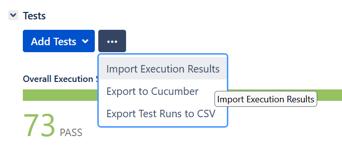

# Installation as a dependency

You just have to install it via npm or yarn (or your prefered package manager)

    npm install mocha-xray-reporter

or    
    
    yarn add mocha-xray-reporter

# Configuration with Mocha

If you launch your tests directly with Mocha, you can add these options to make the reporter work

    mocha [folder of your tests]/*.spec.ts --reporter=mocha-xray-reporter/reporters/reporter.js --reporter-options jiraProjectId=M2X,reportPath=xray.json,ticketPrefix=@TICKET-,stepPrefix=@STEP-,screenshotDir=screenshots,manualId=@MANUAL

With the following variables :

- **jiraProjectId**: How you identify your project in Jira. Mandatory.
- **ticketPrefix**: The prefix used to identify the ticket number. Default to "@TICKET-".
- **stepPrefix**:The prefix used to identify the step number. Default to "@STEP-".
- **manualId**: The keyword to use if you want your final status to be "IN PROGRESS" instead of "PASS" (see [Behaviour part](### Behaviour)). Default to "@MANUAL".
- **reportPath**: The path to write the report file with all the results. Default to "xray.json".
- **screenshotPath**: Where to find the screenshots, to add them as proofs in the report. Default to "cypress/screenshots".

# Configuration with Cypress

Once the reporter is installed, you have to configure it like any Mocha reporter for Cypress, in cypress.config.ts

    "reporter": "mochaXrayReporter/reporters/reporter.js",
    "reporterOptions": {
      "jiraProjectId": "M2X",
      "ticketPrefix": "@TICKET-",
      "stepPrefix": "@STEP-",
      "manualId": "@MANUAL",
      "reportPath": "xray.json",
      "screenshotPath": "path/to/screenshots"
    }

# Multiple reporter

You may already have one or several reporters with mocha : spec, junit, etc.
In this case, you'll have to use the multi-reporter library :

    https://www.npmjs.com/package/mocha-multi-reporters

And if you use Cypress, the cypress multi-reporter library

    https://www.npmjs.com/package/cypress-multi-reporters

The key to reference mocha-xray-reporter is  `MochaXrayReporterReportersReporterJsReporterOptions` // TBD

Example:

    reporter: 'cypress-multi-reporters',
    reporterOptions: {
      reporterEnabled: 'mocha-xray-reporter/reporters/reporter.js, spec',
      MochaXrayReporterReportersReporterJsReporterOptions: {
        jiraProjectId: 'M2X',
        ticketPrefix: '@TICKET-',
        stepPrefix: '@STEP-',
        reportPath: 'xray.json',
        screenshotPath: 'cypress/screenshots'
      },
    },

# Usage in test code

Once the reporter is configured, you only have to specify the ticket and the step reference in the test title

      context('This is an optional context')
        describe('This is an optional describe')
          it('Should generate a result in the xray.json file @TICKET-1 @STEP-1', () => {
            ...
          }

The references (according to what you configured for the reporter):

- '@TICKET-' (ticketPrefix) Will be used to extract the ticket number
- '@STEP-'  (stepPrefix) Will be used to extract the step number

The rules:

- Both annotation are required in the title to generate a result for a test
- You can put them in any order or place in the title.
- What follows the annotation should only be numbers : 1, 7 486, 2946, etc.
- The ticket number should correspond to a Test type existing ticket in Jira
- You can put the tests referencing different steps of the same ticket in any order or event separate files

# Behaviour

With these configurations and information in each test, here is how the reporter behave :

- Step status can be, according to the test status :
  - If a test is failed --> Step status is "FAIL"
  - If a test end up with errors --> Step status is "FAIL"
  - If a test is successful --> Step status is "PASS"
  - If a test is skipped --> Step status is "RENONCEMENT"
  - If a test as the "@MANUAL" annotation and is successful --> Step status is "PENDING" 
- Ticket and step number are sorter in number order
- If a step is missing (like 1, 2, 4 but no 3), it will be completed with a "TODO" step
- Ticket status is calculated according to its Steps status
  - If a Step is "FAIL" --> Ticket status is "FAIL"
  - Otherwise, if a step is "RENONCEMENT" --> Ticket status is "RENONCEMENT"
  - Otherwise, if a step is "PENDING" --> Ticket status is "PENDING"
  - Otherwise, if a step is "TODO" --> Ticket status is "TODO"
  - Otherwise --> Ticket status is "PASS"
- If there is several tests with the same Ticket and Step reference, only the first will prevail
- If a screenshot is found in the 'screenshotPath' path and contain Ticket and Step annotation, it will be added in the proofs list

# Results

With the previously seen configuration ('M2X'), environment variable 'M2X_VERSION' containing 'DEVELOP' and the test with '@TICKET-1' and '@STEP-1', we get the following file content

    {
      "info": {
        "summary": "Automatic tests execution for version DEVELOP"
      },
      "tests": [
        {
          "testKey": "M2X-1",
          "status": "PASS",
          "start": "2022-02-07T08:56:26.152Z",
          "finish": "2022-02-07T08:56:28.465Z",
          "steps": [
            {
              "status": "PASS",
              "actualResult": "Should generate a result in the xray.json file @TICKET-1 @STEP-1",
              "evidences": [
                {
                  "data": "data",
                  "filename": "This is an optional context -- This is an optional describe -- Should generate a result in the xray.json file @TICKET-1 @STEP-1.png",
                  "contentType": "image/png"
                }
              ]
            }
          ]
        }
      ]
    }

# Continuous Integration (CI) configuration

If you want to upload the Xray file with your CI tool (Jenkins, Gitlab, Circle, Travis, etc.), you'll have 2 environment variables to use :

- M2X_JIRA_TEST_EXEC_VERSION : if set, the 'summary' info in xray will be set to 'Automatic tests execution for version-M2X_JIRA_TEST_EXEC_VERSION'.
- M2X_JIRA_TEST_EXEC_NUMBER : if set, the 'testExecutionKey' info in xray will be set to 'jiraProjectId-M2X_JIRA_TEST_EXEC_NUMBER'. It will the update the Test Exec references. Otherwise it will create a new ticket at the upload

# Upload into Jira

## Manual upload

To upload manually tests results, you have to create a "Test Exec" ticket into Jira. 
Then, in the Tests section, you'll have the possibility to choose "Import Execution Tests"

Once it's done, you'll be able to see the results of the Test tickets in this Test Exec

## Automatic upload

You can use you prefered CI integration tool to automatically upload the result into Jira

### Jenkins

For Jenkins, you can easily use this plugin to upload the result into Jira

    https://github.com/jenkinsci/xray-connector-plugin

Then you can use the plugin into your Jenkins Groovy file 

    step([$class: 'XrayImportBuilder', endpointName: '', importFilePath: 'xray.json', importToSameExecution: 'true', projectKey: '##TRIGRAMME PROJECT##', serverInstance: '##ID INSTANCE JIRA SERVER##'])
